= Get Started with JHipster 6
:author: Matt Raible
:email:  matt@raibledesigns.com
:revnumber: 1.0
:revdate:   {docdate}
:subject: JHipster
:keywords: JHipster, Angular, Spring Boot, Bootstrap 4, JHipster 6, Angular 7, Angular 8
:icons: font
:lang: en
:language: javadocript
:sourcedir: .
ifndef::env-github[]
:icons: font
endif::[]
ifdef::env-github,env-browser[]
:toc: preamble
:toclevels: 2
endif::[]
ifdef::env-github[]
:status:
:outfilesuffix: .adoc
:!toc-title:
:caution-caption: :fire:
:important-caption: :exclamation:
:note-caption: :paperclip:
:tip-caption: :bulb:
:warning-caption: :warning:
endif::[]
:toc:

This article shows you how to build a simple blog application with https://www.jhipster.tech/2019/06/23/jhipster-release-6.1.2.html[JHipster 6.1.2]. You can also https://youtu.be/uQqlO3IGpTU[watch a screencast of this tutorial on YouTube].

ifdef::env-github[]
TIP: It appears you're reading this document on GitHub. If you want a prettier view, install https://chrome.google.com/webstore/detail/asciidoctorjs-live-previe/iaalpfgpbocpdfblpnhhgllgbdbchmia[Asciidoctor.js Live Preview for Chrome], then view the https://raw.githubusercontent.com/mraible/jhipster6-demo/master/README.adoc[raw document].
endif::[]

.Source Code
****
If you'd like to get right to it, the https://github.com/mraible/jhipster6-demo[source code for this application is on GitHub]. To run the app, use `./mvnw`. To test it, run `./mvnw verify`. To run its end-to-end tests, run `./mvnw` in one terminal and `npm run e2e` in another.
****

== What is JHipster?

JHipster is one of those open-source projects you stumble upon and immediately think, "`Of course!`" It combines three very successful frameworks in web development: Bootstrap, Angular, and Spring Boot. Bootstrap was one of the first dominant web-component frameworks. Its most substantial appeal was that it only required a bit of HTML and it worked! All the efforts we made in the Java community to develop web components were shown a better path by Bootstrap. It leveled the playing field in HTML/CSS development, much like Apple's Human Interface Guidelines did for iOS apps.

https://www.julien-dubois.com/[Julien Dubois] started JHipster in October 2013 (Julien's first commit was on https://github.com/jhipster/generator-jhipster/commit/c8630ab7af7b6a99db880b3b0e2403806b7d2436[October 21, 2013]). The first public release (version 0.3.1) launched on December 7, 2013. Since then, the project has had over 194 releases! It is an open-source, Apache 2.0-licensed project on GitHub. It has a core team of 29 developers and over 500 contributors. You can find its homepage at https://www.jhipster.tech/[www.jhipster.tech]. If you look at https://github.com/jhipster/generator-jhipster[the project on GitHub], you can see it's mostly written in JavaScript (36%) and Java (28%).

JHipster 6 is the same JHipster many developers know and love, with a couple of bright and shiny new features: namely Java 11 and Spring Boot 2.1 support.

== Install JHipster 6

The http://www.jhipster.tech/installation/[Installing JHipster] instructions show you all the tools you'll need to use a released version of JHipster.

. Install Java 11 https://sdkman.io/[using SDKMAN!]
. Install Git from https://git-scm.com.
. Install Node.js from http://nodejs.org. JHipster recommends using a LTS release.
. Run the following command to install JHipster.

    npm i -g generator-jhipster@6.1.2

NOTE: If you're using Yarn, run `yarn global add generator-jhipster@6.1.2`.

== Create a Project

To create a project, open a terminal window and create a directory. For example, `mkdir blog`. Navigate into the directory and run `jhipster`. You'll be prompted to answer a number of questions about the type of application you want to create and what features you'd like to include. The screenshot below shows the choices I made to create a simple blog application with Angular.

.Generating the application
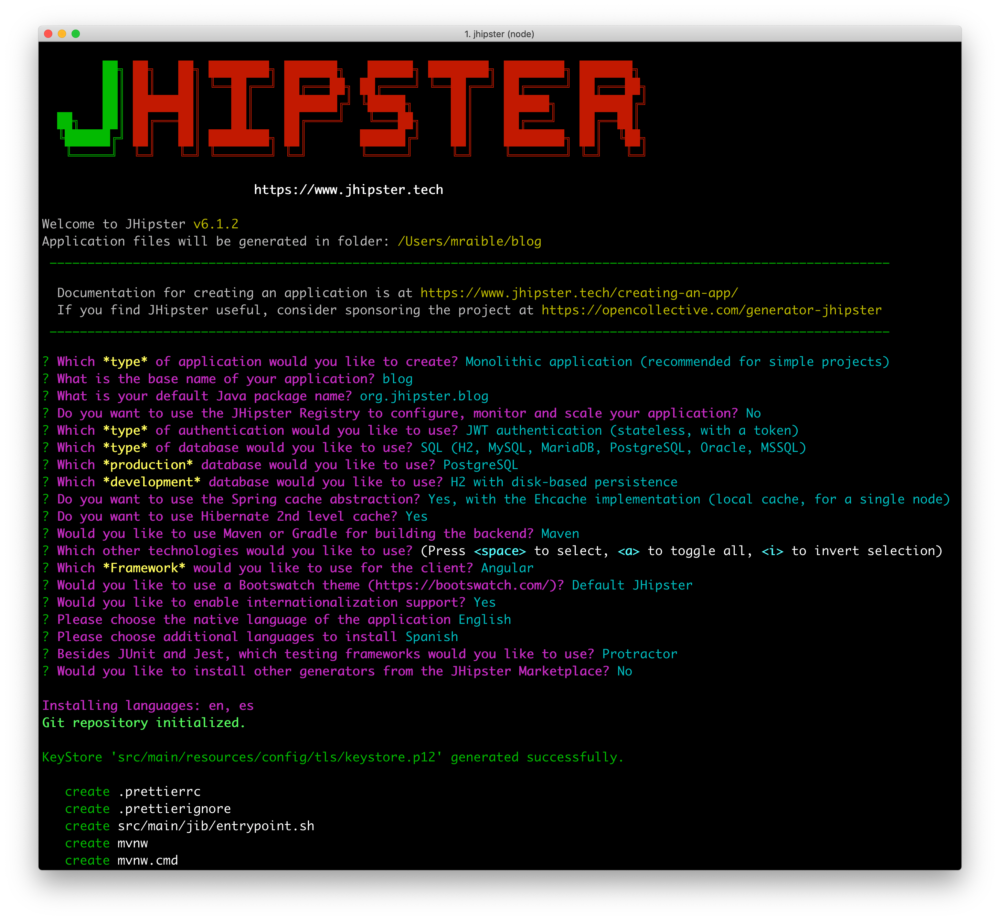

If you'd like to create the same application I did, you can place the following `.yo-rc.json` file in an empty directory and run `jhipster` in it. You won't be prompted to answer any questions because the answers are provided by this file.

[source,json]
----
{
  "generator-jhipster": {
    "promptValues": {
      "packageName": "org.jhipster.blog",
      "nativeLanguage": "en"
    },
    "jhipsterVersion": "6.1.2",
    "applicationType": "monolith",
    "baseName": "blog",
    "packageName": "org.jhipster.blog",
    "packageFolder": "org/jhipster/blog",
    "serverPort": "8080",
    "authenticationType": "jwt",
    "cacheProvider": "ehcache",
    "enableHibernateCache": true,
    "websocket": false,
    "databaseType": "sql",
    "devDatabaseType": "h2Disk",
    "prodDatabaseType": "postgresql",
    "searchEngine": false,
    "messageBroker": false,
    "serviceDiscoveryType": false,
    "buildTool": "maven",
    "enableSwaggerCodegen": false,
    "jwtSecretKey": "OWFlMTQ2YjU3NjI0ODUwZmY5OTEyOWYzMDVlY2YyZjMzNDZlNjNkMzNhNTM1NjIwZDg1OTI5ODExMzA1YTdmMjAxOWM4NjEzZjhkMGNkYjQ0NWUzMGI4M2U5MzJlNDg2NDhhZWFkODZhYTI2YWQ3YWRmZWFhNzk5MGI4NzY5YTk=",
    "useSass": true,
    "clientPackageManager": "npm",
    "clientFramework": "angularX",
    "clientTheme": "none",
    "clientThemeVariant": "",
    "testFrameworks": ["protractor"],
    "jhiPrefix": "jhi",
    "entitySuffix": "",
    "dtoSuffix": "DTO",
    "otherModules": [],
    "enableTranslation": true,
    "nativeLanguage": "en",
    "languages": ["en", "es"]
  }
}
----

TIP: **What about React?** If you'd like to see how to use JHipster to build a React app, see https://developer.okta.com/blog/2018/06/25/react-spring-boot-photo-gallery-pwa[Build a Photo Gallery PWA with React, Spring Boot, and JHipster].

The project creation process will take a couple of minutes to run, depending on your internet connection speed. When it's finished, you should see output like the following.

.Generation success
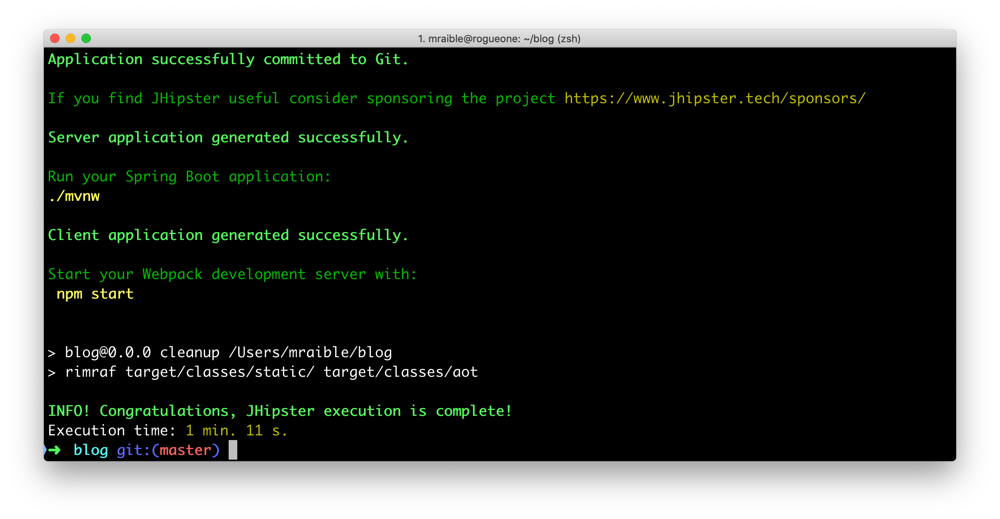

Run `./mvnw` to start the application and navigate to http://localhost:8080 in your favorite browser. The first thing you'll notice is a hipster explaining how you can sign in or register.

.Default homepage
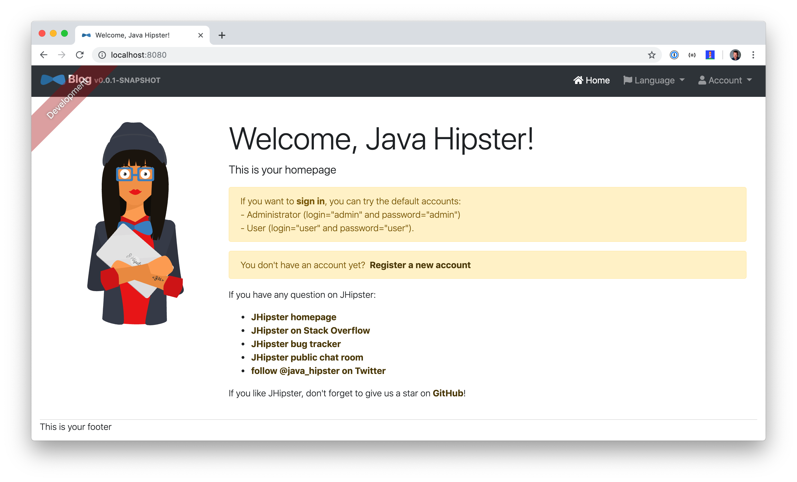

Sign in with username `admin` and password `admin`, and you'll have access to navigate through the Administration section. This section offers nice looking UIs on top of some Spring Boot's many monitoring and configuration features. It also allows you to administer users:

.User management
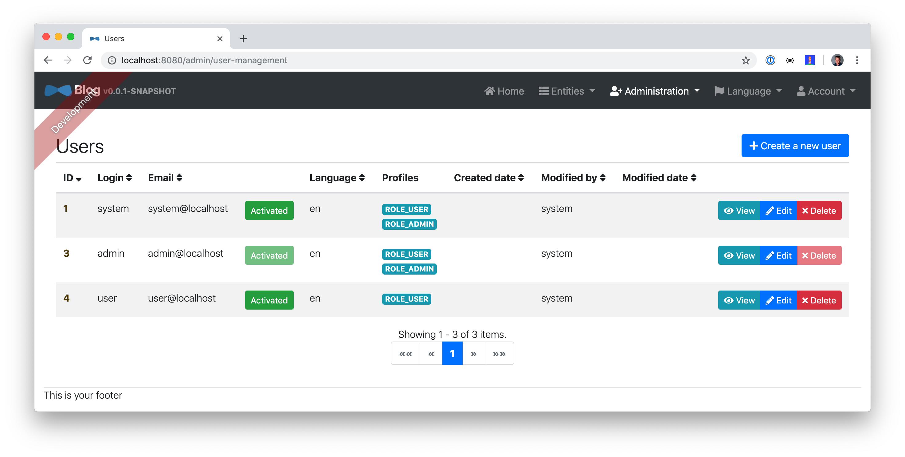

It gives you insights into Application and JVM metrics:

.Application metrics
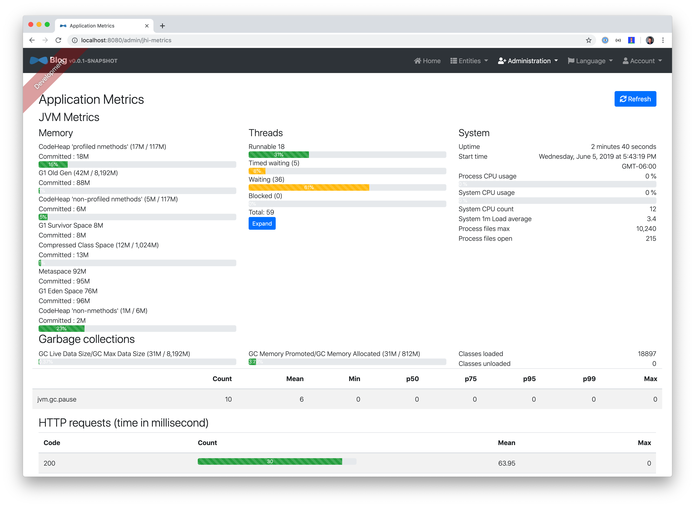

And it allows you to see the Swagger docs associated with its API.

.Swagger docs
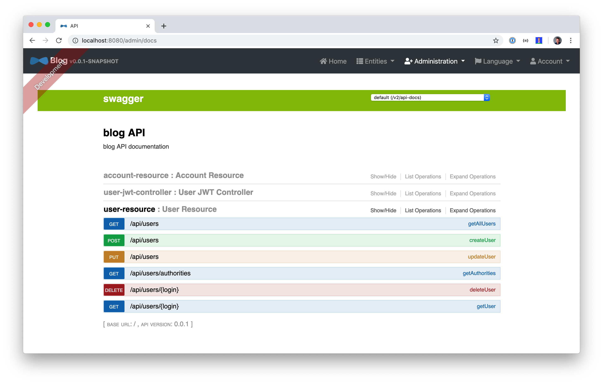

You can run the following command (in a separate terminal window) to run the Protractor tests and confirm everything is working correctly.

----
npm run e2e
----

== Generate Entities

For each entity you want to create, you will need:

* a database table;
* a Liquibase change set;
* a JPA entity class;
* a Spring Data `JpaRepository` interface;
* a Spring MVC `RestController` class;
* an Angular list component, edit component, service; and
* several HTML pages for each component.

Also, you should have integration tests to verify that everything works and performance tests to confirm that it runs fast. In an ideal world, you'd also have unit tests and integration tests for your Angular code.

The good news is JHipster can generate all of this code for you, including integration tests and performance tests. Also, if you have entities with relationships, it will create the necessary schema to support them (with foreign keys), and the TypeScript and HTML code to manage them. You can also set up validation to require certain fields as well as control their length.

JHipster supports several methods of code generation. The first uses its https://www.jhipster.tech/creating-an-entity/[entity sub-generator]. The entity sub-generator is a command-line tool that prompts you with questions which you answer.

https://start.jhipster.tech/jdl-studio/[JDL-Studio] is a browser-based tool for defining your domain model with JHipster Domain Language (JDL). I like the visual nature of JDL-Studio, so I'll use it for this project.

Below is the entity diagram and JDL code needed to generate a simple blog with blogs, entries, and tags.

.Blog entity diagram
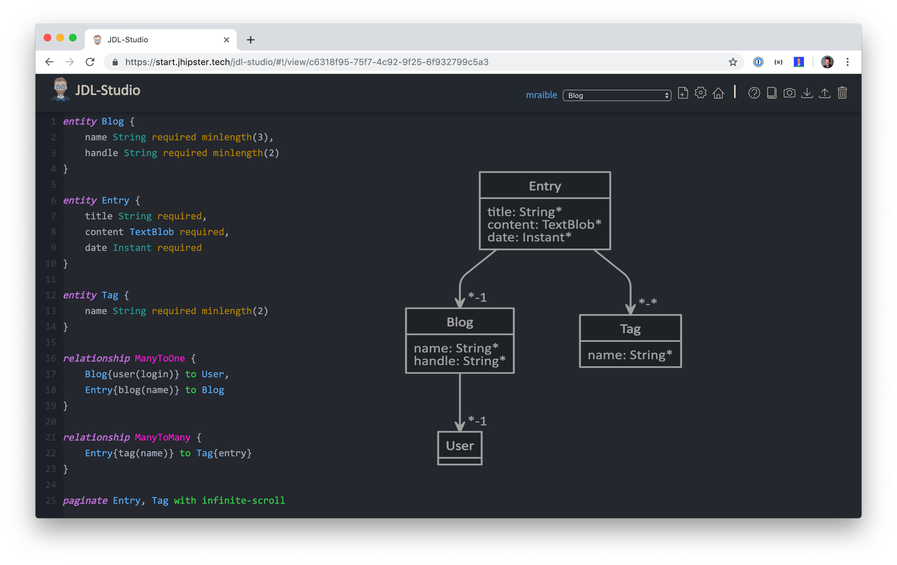

TIP: You can find a few other https://github.com/jhipster/jdl-samples[JDL samples on GitHub].

If you'd like to follow along, copy/paste the contents of the JDL below into a `blog.jdl` file.

.blog.jh
----
entity Blog {
  name String required minlength(3),
  handle String required minlength(2)
}

entity Entry {
  title String required,
  content TextBlob required,
  date Instant required
}

entity Tag {
  name String required minlength(2)
}

relationship ManyToOne {
  Blog{user(login)} to User,
  Entry{blog(name)} to Blog
}

relationship ManyToMany {
  Entry{tag(name)} to Tag{entry}
}

paginate Entry, Tag with infinite-scroll
----

Run the following command to import this file and generate entities, tests, and a UI.

----
jhipster import-jdl blog.jdl
----

You'll be prompted to overwrite `src/main/resources/config/liquibase/master.xml`. Type **a** to overwrite this file, as well as others.

Restart the application with `/.mvnw`.

You might notice that each entities list screen is pre-loaded with data. This is done by https://github.com/marak/Faker.js/[faker.js]. To turn it off, edit `src/main/resources/config/application-dev.yml`, search for `faker` and remove it from the `liquibase.contexts` configuration. I made this change in this example's code.

[source,yaml]
----
liquibase:
 # Add 'faker' if you want the sample data to be loaded automatically
 contexts: dev
----

TIP: If you still have data in your list screens after making this change, run `./mvnw clean` to delete the H2 database.

Create a couple of blogs for the existing `admin` and `user` users, as well as a few blog entries.

.Blogs
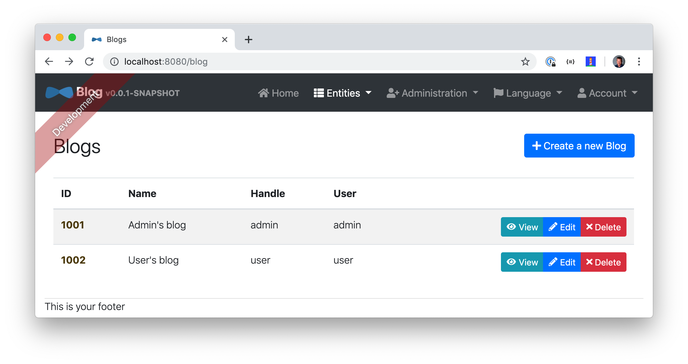

.Entries
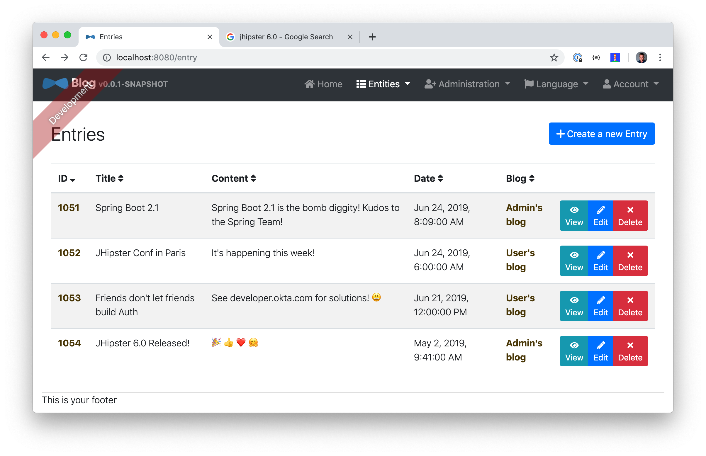

From these screenshots, you can see that users can see each other's data, and modify it.

== Add Business Logic

TIP: To configure an IDE with your JHipster project, see https://www.jhipster.tech/configuring-ide/[Configuring your IDE]. Instructions exist for Eclipse, IntelliJ IDEA, Visual Studio Code, and NetBeans.

To add more security around blogs and entries, open `BlogResource.java` and find the `getAllBlogs()` method. Change the following line:

[source,java]
.src/main/java/org/jhipster/blog/web/rest/BlogResource.java
----
return blogRepository.findAll();
----

To:

[source,java]
.src/main/java/org/jhipster/blog/web/rest/BlogResource.java
----
return blogRepository.findByUserIsCurrentUser();
----

The `findByUserIsCurrentUser()` method is generated by JHipster in the `BlogRepository` class and allows limiting results by the current user.

[source,java]
.src/main/java/org/jhipster/blog/repository/BlogRepository.java
----
public interface BlogRepository extends JpaRepository<Blog, Long> {

    @Query("select blog from Blog blog where blog.user.login = ?#{principal.username}")
    List<Blog> findByUserIsCurrentUser();

}
----

After making this change, re-compiling `BlogResource` should trigger a restart of the application thanks to http://docs.spring.io/spring-boot/docs/current/reference/html/using-boot-devtools.html[Spring Boot's Developer tools]. If you navigate to http://localhost:8080/blog, you should only see the blog for the current user.

.Admin's blog
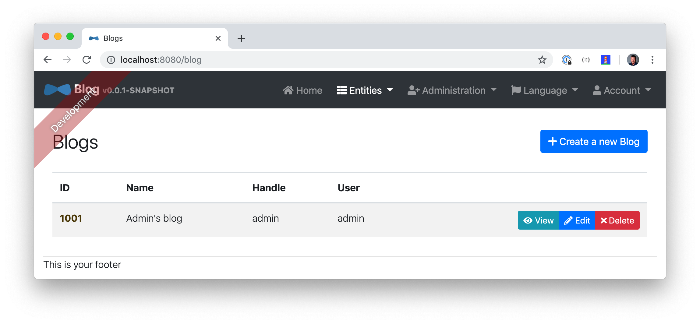

To add this same logic for entries, open `EntryResource.java` and find the `getAllEntries()` method. Change the following line:

[source,java]
.src/main/java/org/jhipster/blog/web/rest/EntryResource.java
----
Page<Entry> page;
if (eagerload) {
    page = entryRepository.findAllWithEagerRelationships(pageable);
} else {
    page = entryRepository.findAll(pageable);
}
----

To:

[source,java]
.src/main/java/org/jhipster/blog/web/rest/EntryResource.java
----
page = entryRepository.findByBlogUserLoginOrderByDateDesc(SecurityUtils.getCurrentUserLogin().orElse(null), pageable);
----

Using your IDE, create this method in the `EntryRepository` class. It should look as follows:

[source,java]
.src/main/java/org/jhipster/blog/repository/EntryRepository.java
----
Page<Entry> findByBlogUserLoginOrderByDateDesc(String currentUserLogin, Pageable pageable);
----

Recompile both changed classes and verify that the `user` user only sees the entries you created for them.

.User's entries
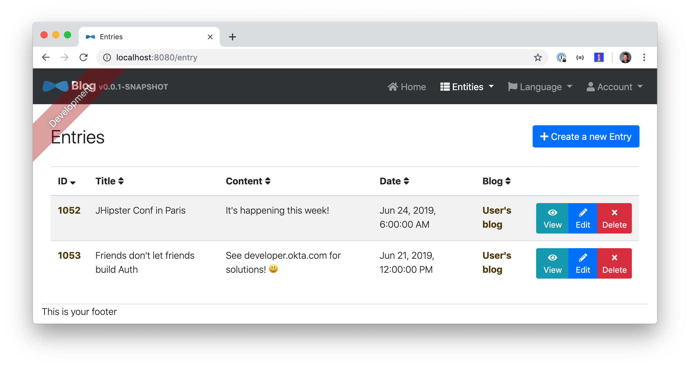

You might notice that this application doesn't look like a blog and it doesn't allow HTML in the content field.

== Make UI Enhancements

When doing UI development on a JHipster-generated application, it's nice to see your changes as soon as you save a file. JHipster uses https://www.browsersync.io/[Browsersync] and https://webpack.github.io/[webpack] to power this feature. You enable this feature by running the following command in the `blog` directory.

----
npm start
----

In this section, you'll change the following:

. Change the rendered content field to display HTML
. Change the list of entries to look like a blog

=== Allow HTML

If you enter HTML in the `content` field of a blog entry, you'll notice it's escaped on the list screen.

.Escaped HTML
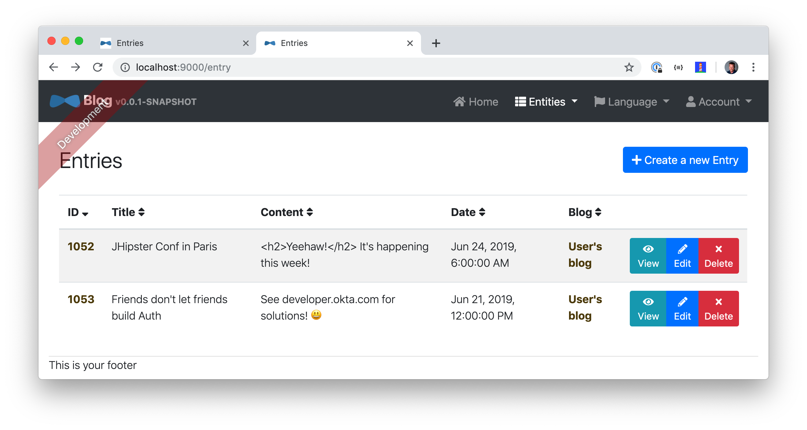

To change this behavior, open `entry.component.html` and change the following line:

[source,html]
.src/main/webapp/app/entities/entry/entry.component.html
----
<td>{{entry.content}}</td>
----

To:

[source,html]
.src/main/webapp/app/entities/entry/entry.component.html
----
<td [innerHTML]="entry.content"></td>
----

After making this change, you'll see that the HTML is no longer escaped.

.HTML in entries
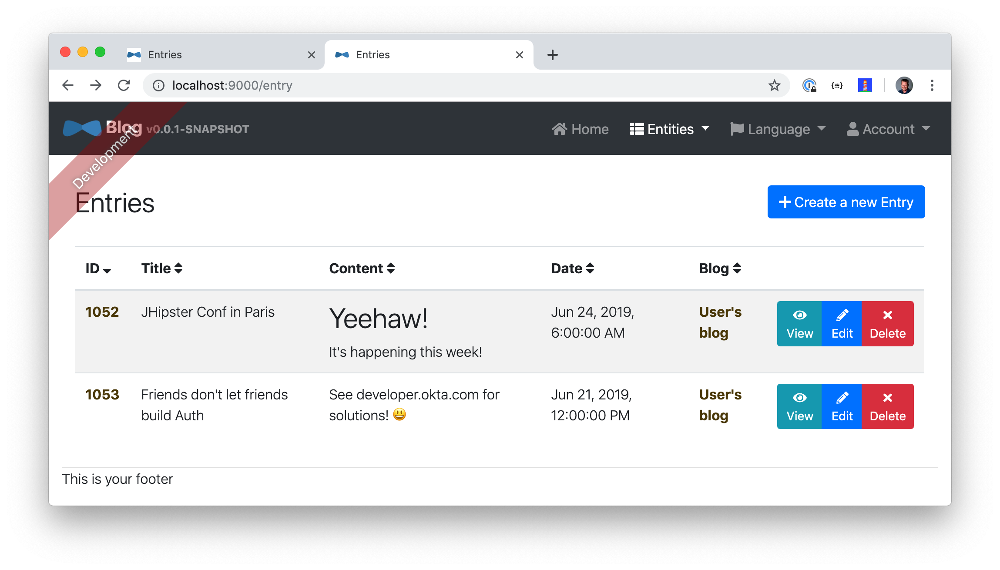

=== Improve the layout

To make the list of entries look like a blog, replace `
` with HTML, so it uses a stacked layout in a single column.

[source,html]
.src/main/webapp/app/entities/entry/entry.component.html
----

 0">
    
= links['last']" [infiniteScrollDistance]="0">
        

            <a [routerLink]="['/entry', entry.id, 'view' ]">
                <h2>{{entry.title}}</h2>
            </a>
            <small>Posted on {{entry.date | date: 'short'}} by {{entry.blog.user.firstName}}</small>
            

            

                <button type="submit"
                        [routerLink]="['/entry', entry.id, 'edit']"
                        class="btn btn-primary btn-sm">
                    <fa-icon [icon]="'pencil-alt'"></fa-icon>
                    Edit
                </button>
                <button type="submit"
                        [routerLink]="['/', 'entry', { outlets: { popup: entry.id + '/delete'} }]"
                        replaceUrl="true"
                        queryParamsHandling="merge"
                        class="btn btn-danger btn-sm">
                    <fa-icon [icon]="'times'"></fa-icon>
                    Delete
                </button>
            

        

    

----

Now it looks more like a regular blog!

.Blog entries
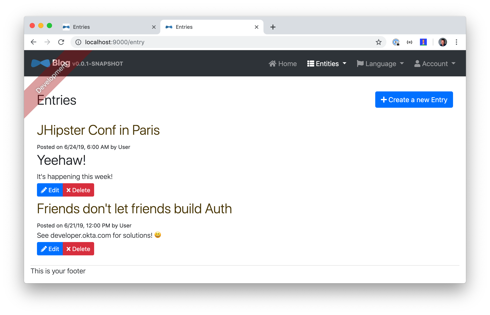

=== Lock It Down!

You can further enhanced the security of your API by only allowing users that own a blog (or entry) to edit it. Here's some sudo-code to show the logic:

[source,java]
----
Optional<Blog> blog = blogRepository.findById(id);
if (blog.isPresent() && <user doesn't match current user>) {
    return new ResponseEntity<>("error.http.403", HttpStatus.FORBIDDEN);
}
return ResponseUtil.wrapOrNotFound(blog);
----

Below is the refactored `BlogResource.java` with additional logic in each method to prevent data tampering.

.src/main/java/org/jhipster/blog/web/rest/BlogResource.java
[source,java]
----
@PostMapping("/blogs")
public ResponseEntity<?> createBlog(@Valid @RequestBody Blog blog) throws URISyntaxException {
    log.debug("REST request to save Blog : {}", blog);
    if (blog.getId() != null) {
        throw new BadRequestAlertException("A new blog cannot already have an ID", ENTITY_NAME, "idexists");
    }
    if (!blog.getUser().getLogin().equals(SecurityUtils.getCurrentUserLogin().orElse(""))) {
        return new ResponseEntity<>("error.http.403", HttpStatus.FORBIDDEN);
    }
    Blog result = blogRepository.save(blog);
    return ResponseEntity.created(new URI("/api/blogs/" + result.getId()))
        .headers(HeaderUtil.createEntityCreationAlert(applicationName, true, ENTITY_NAME, result.getId().toString()))
        .body(result);
}

@PutMapping("/blogs")
public ResponseEntity<?> updateBlog(@Valid @RequestBody Blog blog) throws URISyntaxException {
    log.debug("REST request to update Blog : {}", blog);
    if (blog.getId() == null) {
        throw new BadRequestAlertException("Invalid id", ENTITY_NAME, "idnull");
    }
    if (blog.getUser() != null &&
        !blog.getUser().getLogin().equals(SecurityUtils.getCurrentUserLogin().orElse(""))) {
        return new ResponseEntity<>("error.http.403", HttpStatus.FORBIDDEN);
    }
    Blog result = blogRepository.save(blog);
    return ResponseEntity.ok()
        .headers(HeaderUtil.createEntityUpdateAlert(applicationName, true, ENTITY_NAME, blog.getId().toString()))
        .body(result);
}

@GetMapping("/blogs/{id}")
public ResponseEntity<?> getBlog(@PathVariable Long id) {
    log.debug("REST request to get Blog : {}", id);
    Optional<Blog> blog = blogRepository.findById(id);
    if (blog.isPresent() && blog.get().getUser() != null &&
        !blog.get().getUser().getLogin().equals(SecurityUtils.getCurrentUserLogin().orElse(""))) {
        return new ResponseEntity<>("error.http.403", HttpStatus.FORBIDDEN);
    }
    return ResponseUtil.wrapOrNotFound(blog);
}

@DeleteMapping("/blogs/{id}")
public ResponseEntity<?> deleteBlog(@PathVariable Long id) {
    log.debug("REST request to delete Blog : {}", id);
    Optional<Blog> blog = blogRepository.findById(id);
    if (blog.isPresent() && blog.get().getUser() != null &&
        !blog.get().getUser().getLogin().equals(SecurityUtils.getCurrentUserLogin().orElse(""))) {
        return new ResponseEntity<>("error.http.403", HttpStatus.FORBIDDEN);
    }
    blogRepository.deleteById(id);
    return ResponseEntity.noContent().headers(HeaderUtil.createEntityDeletionAlert(applicationName, true, ENTITY_NAME, id.toString())).build();
}
----

You'll need to make similar changes in `EntryResource.java`. See https://github.com/mraible/jhipster6-demo/commit/73bd82f87274dc013a72839eda5925b5e22f4907[this commit] for all the changes that you'll need in these two classes, as well as their integration tests.

== Deploy to the Cloud

A JHipster application can be deployed anywhere a Spring Boot application can be deployed.

JHipster ships with support for deploying to https://www.jhipster.tech/cloudfoundry/[Cloud Foundry], https://www.jhipster.tech/heroku/[Heroku], https://www.jhipster.tech/kubernetes/[Kubernetes], https://www.jhipster.tech/aws/[AWS], and https://www.jhipster.tech/boxfuse/[AWS with Boxfuse]. I'm using Heroku in this example because it doesn't cost me anything to host it.

When you prepare a JHipster application for production, it's recommended to use the pre-configured "`production`" profile. With Maven, you can package your application by specifying the `prod` profile when building.

----
./mvnw -Pprod verify
----

The production profile is used to build an optimized JavaScript client. You can invoke this using webpack by running `yarn run webpack:prod`.
The production profile also configures gzip compression with a servlet filter, cache headers, and monitoring via
https://micrometer.io/[Micrometer]. If you have a http://graphite.wikidot.com/[Graphite] server configured in
your `application-prod.yml` file, your application will automatically send metrics data to it.

When you run this command, you'll likely get a test failure.

----
[ERROR] Failures:
[ERROR]   BlogResourceIT.createBlog:115 Status expected:<201> but was:<500>
[ERROR]   BlogResourceIT.getAllBlogs:189 Status expected:<200> but was:<500>
[INFO]
[ERROR] Tests run: 144, Failures: 2, Errors: 0, Skipped: 0
----

The reason this happens is in a stack trace in your terminal.

----
org.springframework.dao.InvalidDataAccessApiUsageException: Authentication object cannot be null
----

To fix this, you can use Spring Security Test's http://docs.spring.io/spring-security/site/docs/current/reference/html/test-method.html#test-method-withmockuser[`@WithMockUser`]. Open `BlogResourceIT.java` and inject  `UserRepository` as a dependency.

[source,java]
.src/test/java/org/jhipster/blog/web/rest/BlogResourceIT.java
----
@Autowired
private UserRepository userRepository;
----

Change the `createEntity()` method so it's not `static` and uses the `userRepository` to set a user on the blog entity.

[source,java]
----
public Blog createEntity(EntityManager em) {
    Blog blog = new Blog()
            .name(DEFAULT_NAME)
            .handle(DEFAULT_HANDLE)
            .user(userRepository.findOneByLogin("user").get());
    return blog;
}
----

Add `@WithMockUser` to the `createBlog()`, `getAllBlogs()`, `getBlog()`, `updateBlog()` and `deleteBlog()` methods. Below is an example of how each method should look.

[source,java]
----
@Test
@Transactional
@WithMockUser
public void createBlog() throws Exception {
    // method body
}
----

After fixing this test, you should be able to run `./mvnw -Pprod verify` without any failures.

To deploy this application to Heroku, I logged in to my account using `heroku login` from the command line. I already had the https://devcenter.heroku.com/articles/heroku-command-line[Heroku CLI] installed.

----
$ heroku login
heroku: Press any key to open up the browser to login or q to exit:
Opening browser to https://cli-auth.heroku.com/auth/browser/7dc2d6ea-c27c-4551-8bcd-efaf712c4413
Logging in... done
Logged in as matt@raibledesigns.com
----

I ran `jhipster heroku` as recommended in the http://www.jhipster.tech/heroku/[Deploying to Heroku] documentation. I used the name "`jhipster6-demo`" for my application when prompted. I selected "`Git (compile on Heroku)`" as the type of deployment.

----
$ jhipster heroku
INFO! Using JHipster version installed locally in current project's node_modules
INFO! Executing jhipster:heroku
INFO! Options: from-cli: true
Heroku configuration is starting
? Name to deploy as: jhipster6-demo
? On which region do you want to deploy ? us
? Which type of deployment do you want ? Git (compile on Heroku)

Using existing Git repository

Installing Heroku CLI deployment plugin

Creating Heroku application and setting up node environment
https://jhipster-6-demo.herokuapp.com/ | https://git.heroku.com/jhipster-6-demo.git

Provisioning addons
Created Database addon

Creating Heroku deployment files
   create Procfile
 conflict pom.xml
? Overwrite pom.xml? overwrite this and all others
    force pom.xml
   create src/main/resources/config/bootstrap-heroku.yml
   create src/main/resources/config/application-heroku.yml

Skipping build

Updating Git repository
git add .
git commit -m "Deploy to Heroku" --allow-empty
husky > pre-commit (node v10.15.3)
Stashing changes... [started]
Stashing changes... [skipped]
→ No partially staged files found...
Running linters... [started]
Running tasks for {,src/**/}*.{md,json,ts,css,scss,yml} [started]
prettier --write [started]
prettier --write [completed]
git add [started]
git add [completed]
Running tasks for {,src/**/}*.{md,json,ts,css,scss,yml} [completed]
Running linters... [completed]

Configuring Heroku

Deploying application
remote: Compressing source files... done.
remote: Building source:

... building ...

remote: [INFO] ------------------------------------------------------------------------
remote: [INFO] BUILD SUCCESS
remote: [INFO] ------------------------------------------------------------------------
remote: [INFO] Total time:  20.354 s
remote: [INFO] Finished at: 2019-06-24T03:11:53Z
remote: [INFO] ------------------------------------------------------------------------
To https://git.heroku.com/jhipster-6-demo.git
 * [new branch]      HEAD -> master

Your app should now be live. To view it run
	heroku open
And you can view the logs with this command
	heroku logs --tail
After application modification, redeploy it with
	jhipster heroku
INFO! Congratulations, JHipster execution is complete!
Execution time: 8 min. 33 s.
----

I ran `heroku open`, logged as `admin` and was pleased to see it worked!

.JHipster 6 Demo on Heroku
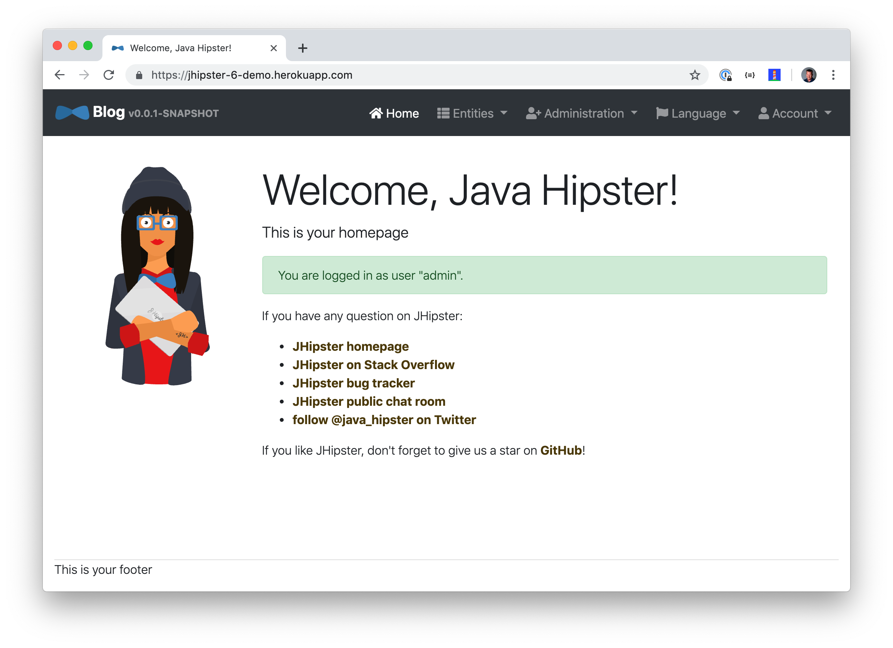

== JHipster: Accelerating Spring Boot + Angular Development

I hope you've enjoyed learning how JHipster can help you develop modern web applications! It's a nifty project, with an easy-to-use entity generator, a pretty UI, and many Spring Boot best-practice patterns. The project team follows five simple https://www.jhipster.tech/policies/[policies], paraphrased here:

1. The development team votes on policies.
2. JHipster uses technologies with their default configurations as much as possible.
3. Only add options when there is sufficient added value in the generated code.
4. For the Java code, follow the default IntelliJ IDEA formatting and coding guidelines.
5. Use strict versions for third-party libraries.

These policies help the project maintain its sharp edge and streamline its development process. If you have features you'd like to add or if you'd like to refine existing features, you can https://github.com/jhipster/generator-jhipster[watch the project on GitHub] and https://github.com/jhipster/generator-jhipster/blob/master/CONTRIBUTING.md[help with its development] and support. We're always looking for help!

Now that you've learned how to use Angular, Bootstrap 4, and Spring Boot with JHipster, go forth and develop great applications!

TIP: Developing microservices with JHipster is possible too! See https://developer.okta.com/blog/2019/05/23/java-microservices-spring-cloud-config[Java Microservices with Spring Cloud Config and JHipster] to learn how. You can also http://www.jhipster-book.com/#!/news/entry/pluralsight-developing-microservices-and-mobile-apps-with-jhipster-play-by-play[watch my Pluralsight Play by Play on Developing Microservices and Mobile Apps with JHipster].

== Learn More about JHipster

To learn more about JHipster and all it has to offer, look no further than https://www.amazon.com/Stack-Development-JHipster-Deepu-Sasidharan/dp/178847631X[Full Stack Development with JHipster] by https://twitter.com/deepu105[Deepu K Sasidharan] and https://twitter.com/sendilkumarn[Sendil Kumar]. Both Deepu and Sendil have contributed an incredible amount of time and code to JHipster. We've very luck to have them. They're both amazing developers! ❤️

JHipster's awesome community has starred in some excellent online training videos too:

* https://therealdanvega.teachable.com/p/jhipster/?product_id=456739&coupon_code=JHIPSTER[Angular 4 Java Developers by Dan Vega and John Thompson]
* https://www.pluralsight.com/courses/scaffolding-spring-boot-and-angular-with-jhipster[Scaffolding Spring Boot and Angular Web Apps with JHipster by Michael Hoffman]
* https://linkedin-learning.pxf.io/c/1252615/449670/8005?u=https%3A%2F%2Fwww.linkedin.com%2Flearning%2Fjhipster-build-and-deploy-spring-boot-microservices%3Ftrk%3Dinsiders_43129714_learning[JHipster: Build and Deploy Spring Boot Microservices by Chris Anatalio]

TIP: If you'd like to see a tutorial that's similar to this one and uses OIDC for authentication, see https://developer.okta.com/blog/2019/04/04/java-11-java-12-jhipster-oidc[Better, Faster, Lighter Java with Java 12 and JHipster 6].

Follow https://twitter.com/java_hipster[@java_hipster] on Twitter for release announcements, articles, new features, and upcoming talks.

== Source Code

The source code for this project is available on GitHub at https://github.com/mraible/jhipster6-demo[mraible/jhipster6-demo].

https://travis-ci.org[Travis CI] is continually testing this project with configuration from its https://github.com/mraible/jhipster6-demo/blob/master/.travis.yml[`.travis.yml`] file. This file was generated using `jhipster ci-cd` and everything https://github.com/mraible/jhipster6-demo/pull/1[passed on the first try]!

== About the Author

**Matt Raible** is a web developer, Java Champion, and Developer Advocate at https://developer.okta.com[Okta]. Matt is a frequent contributor to open source and a big fan of Java, IntelliJ, TypeScript, Angular, and Spring Boot. When he's not slinging code with open source frameworks, he likes to ski with his family, restore classic VWs, and enjoy craft beer.

Matt writes on the http://developer.okta.com/blog[Okta developer blog], for https://www.infoq.com/profile/Matt-Raible/[InfoQ], and on his https://raibledesigns.com/[personal blog]. You can find him on Twitter https://twitter.com/mraible[@mraible].

Matt is a developer on the https://www.jhipster.tech/team/[JHipster team], authored the https://www.infoq.com/minibooks/jhipster-mini-book[JHipster Mini-Book], and helped create https://www.pluralsight.com/courses/play-by-play-developing-microservices-mobile-apps-jhipster[Play by Play: Developing Microservices and Mobile Apps with JHipster].
